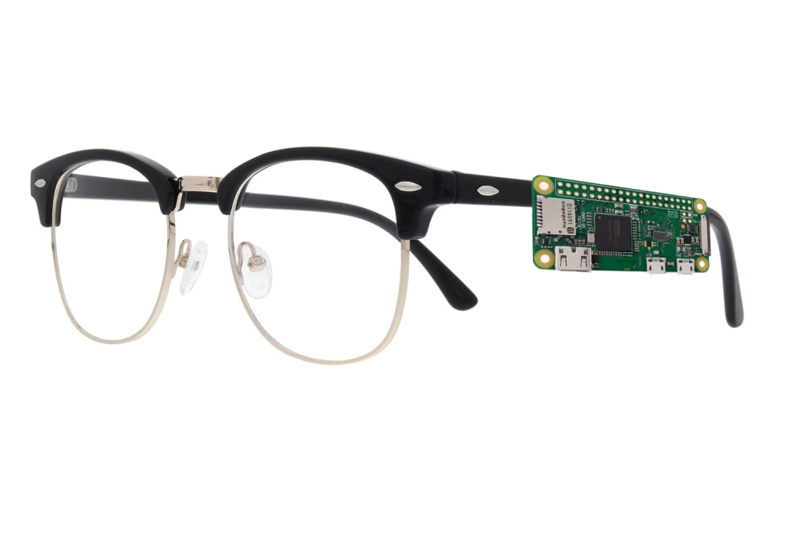
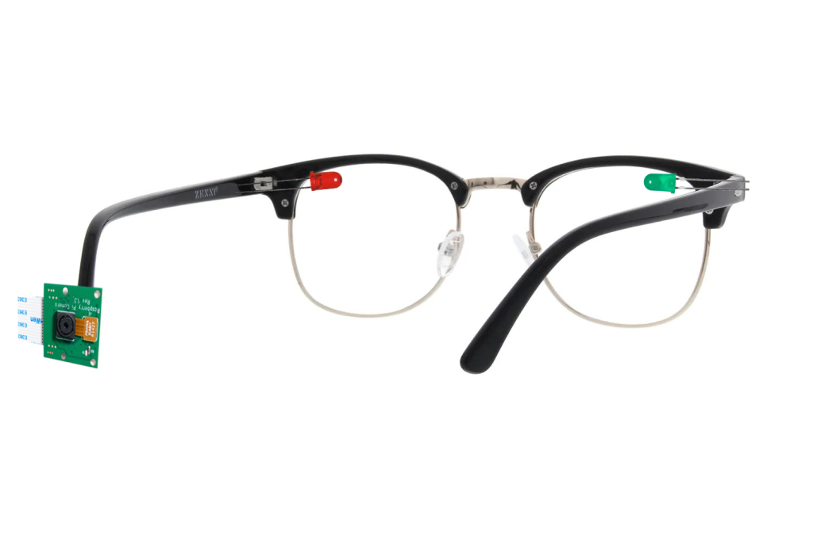
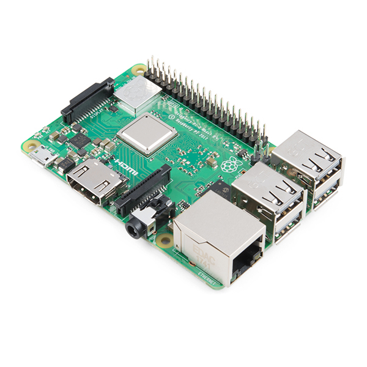
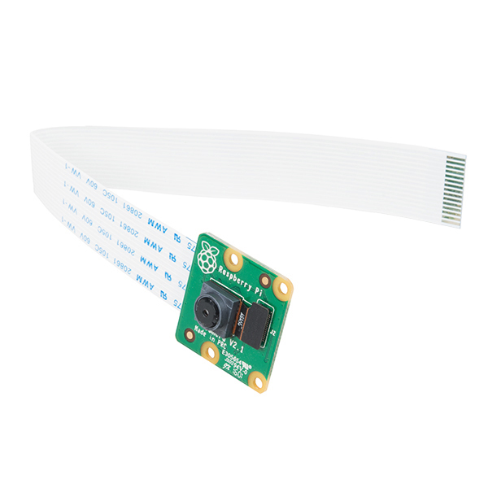
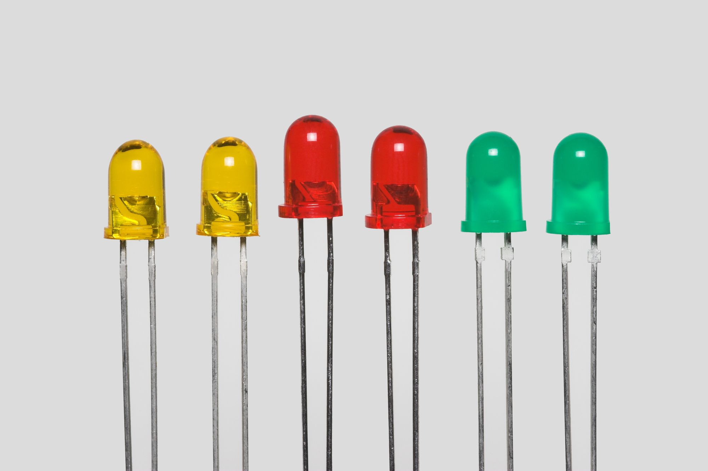
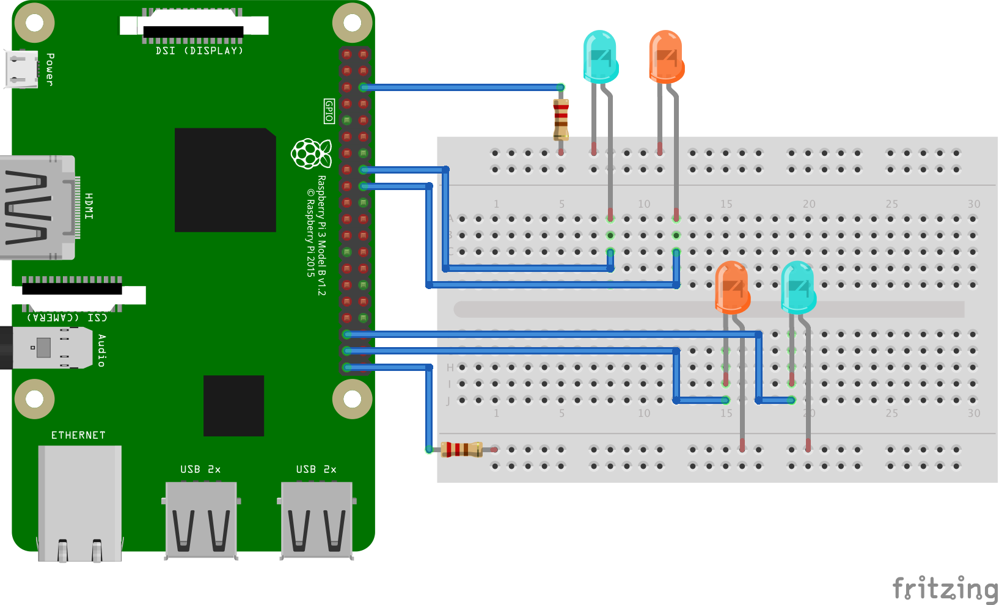

# Project Side Mirror

> Get to know what's happening behind you without turning your head around, with Project SideMirror.


Raspberry Pi Zero W on the side of a pair of glasses


RGB leds on the corner of each side the glasses, behind the lenses, Camera pointing backward/outward

## Demo

[](http://www.youtube.com/watch?v=FN6Ix4j6pyA "Project SideMirror Demo")

## Intro

This project is the final assignment for the ITP class `Machine Learning for Physical Computing

## Project Abstract

`Project SideMirror` is a wearable device which functions as a side mirror (like a car's) without incorporating a physical mirror, but a camera with a machine learning algorithm. Users can easily comprehend the context of what is happening at their back without turning their heads around.

## The Problem?

Being an (inexperienced) driver, or even just a pedestrian, I have encountered the problem of swithcing lanes when I am trying to overtake cars or people. Frankly, it could be still be as serious as a problem to pump into someone else if you are striding rapidly in a crowd, just like how you crash into other’s cars at your back of both sides in high speed.

## Application

That’s when Project SideMirror comes in handy. Essentially the two cameras mounted on the two sides of your head will provide a stream of video for the ***PoseNet*** **TensorFlow Lite** machine learning algorithm to analyse for person's position and gesture, and the feedback will be returned to the user visually. The user will get notified of what is at their back by the blinking LED, in order to provide the user insight for whether it is safe to switch lane or not.

In particular, A blue light signals a `safe`, where a yellow light signals a `alert`. In addition, a blinking yellow light indicates a person is raising hand.

## More potential (pragmatic) application

More practical application?
May be it can be a nifty invention for bikers, or motor bikers? Despite the fact that self-driving car technology has been burgeoning, bikers and motor-bikers are not enjoying such technology which can somehow safeguard their life’s.

## Development

### Hardware


Raspberry Pi 3B+


Pi Camera


Color LEDs

### Wiring


### Coding

#### Disclaimer:

The code, specfically for the TensorFlow model loading and interpreting functionality, is mostly based on `How to Run TensorFlow Lite Object Detection Models on the Raspberry Pi (with Optional Coral USB Accelerator)` by GitHub user `EdjeElectronics`. The tutorial can be found [here](https://github.com/EdjeElectronics/TensorFlow-Lite-Object-Detection-on-Android-and-Raspberry-Pi/blob/master/Raspberry_Pi_Guide.md)

#### Running Python on the Pi

I am used to `SSH` from my Mac to connect to the Pi, and edit the code with `Vim` editor within the `Terminal`. Otherwise you can connect an HDMI monitor, a keyboard and a mouse to perform all the coding locally on the Pi. 

Clone the GitHub repo to your Pi

``` Terminal
git clone https://github.com/jasontsemf/ProjectSideMirror.git
```

Once you have clone this repo to your Pi. Activate the virtual environment by:

``` Terminal
source tflite1-env/bin/activate
```

The virtual environment is used for keeping your packages independent from the environment outside your virtual environment. Just to ensure your code running environment is stable.

Then run:

``` Terminal
python3 TFLite_detection_webcam.py --modeldir=PoseNet_TFLite_model
```

The `--modeldir` argument is used for assigning the right TensorFlow Lite model to run.

If the code is successfully being ran, try to **move towards to the left in front of the PiCamera and raise your left hand**, you should be able to see output like below.

``` Terminal
-------
side: left raise hand: raise left
```

For your circuit, the **left yellow LED** should **blink**, and the **right blue LED** should **light up**.

#### Understanding the code

As explained, the model loading and interpreting part of the code is implemented by GitHub user `EdjeElectronics`, and the original code was designed to run the `MobileNet TensorFlow Lite` machine learning model. Parsing the output of `PoseNet` is drastically different from `MobileNet`. The heavy lifting of parsing the `PoseNet` output is being explained on [Real-time Human Pose Estimation in the Browser with TensorFlow.js](https://medium.com/tensorflow/real-time-human-pose-estimation-in-the-browser-with-tensorflow-js-7dd0bc881cd5), and has been done by GitHub user `ziggyjosh16` at [app-fall-detector](https://github.com/ziggyjosh16/app-fall-detector/blob/master/person.py).

And here is a deep dive of the things being added and modified.

``` python
# set up LED pins and status
l_blue = 26
l_yellow = 19
r_blue = 23
r_yellow = 24
l_yellow_state = True
r_yellow_state = True

GPIO.setwarnings(False)
GPIO.setmode(GPIO.BCM)
GPIO.setup(l_blue, GPIO.OUT)
GPIO.setup(l_yellow, GPIO.OUT)
GPIO.setup(r_blue, GPIO.OUT)
GPIO.setup(r_yellow, GPIO.OUT)
```

``` python
# defining the part names corresponding to the designated IDs
PARTS = {
    0: 'NOSE',
    1: 'LEFT_EYE',
    2: 'RIGHT_EYE',
    3: 'LEFT_EAR',
    4: 'RIGHT_EAR',
    5: 'LEFT_SHOULDER',
    6: 'RIGHT_SHOULDER',
    7: 'LEFT_ELBOW',
    8: 'RIGHT_ELBOW',
    9: 'LEFT_WRIST',
    10: 'RIGHT_WRIST',
    11: 'LEFT_HIP',
    12: 'RIGHT_HIP',
    13: 'LEFT_KNEE',
    14: 'RIGHT_KNEE',
    15: 'LEFT_ANKLE',
    16: 'RIGHT_ANKLE'
}
```

``` python
# Mathematical function for processing heatmaps
def sigmoid(x):
    return 1 / (1 + np.exp(-x))
```

> The sigmoid activation function, also called the logistic function, is traditionally a very popular activation function for neural networks. The input to the function is transformed into a value between 0.0 and 1.0.

The actual parsing starts below:
`scores` (confidence), and the `heatmap` is the most crucial elements from the output data. Multiple math operations has to be done to parse them into usable XY coordinates with the corresponding IDs and its condifence scores.

``` python
# Class reference ziggyjosh16 from GitHub repo app-fall-dector
# https://github.com/ziggyjosh16/app-fall-detector/blob/master/person.py
class Person():
    def __init__(self, heatmap, offsets):
        self.keypoints = self.get_keypoints(heatmap, offsets)
        self.pose = self.infer_pose(self.keypoints)

    # output stride: resolution = ((InputImageSize - 1) / OutputStride) + 1
    # 9 = ((257-1)/ x) + 1 x = 32
    def get_keypoints(self, heatmaps, offsets, output_stride=32):
        # sigmoid activation to get scores
        scores = sigmoid(heatmaps)
        # shape from numpy returns the length of the third dimension
        num_keypoints = scores.shape[2]
        heatmap_positions = []
        offset_vectors = []
        confidences = []
        # loop through all keypoints
        for ki in range(0, num_keypoints):
            # get 2D index from a linear index
            x, y = np.unravel_index(
                # get index for the largest value for the currnet tensor within the activated axis
                np.argmax(scores[:, :, ki]), scores[:, :, ki].shape)
            confidences.append(scores[x, y, ki])
            offset_vector = (offsets[y, x, ki],
                             offsets[y, x, num_keypoints + ki])
            heatmap_positions.append((x, y))
            offset_vectors.append(offset_vector)
        # add up two arrays
        image_positions = np.add(
            np.array(heatmap_positions) *
            output_stride,
            offset_vectors)
        # instantiate Keypoint sub object
        keypoints = [KeyPoint(i, pos, confidences[i])
                     for i, pos in enumerate(image_positions)]
        return keypoints
```


``` python
    # function defined by jasontsemf
    # determine if the detected is on the left/right on the camera image
    def get_side(self):
        if(self.keypoints[0].get_confidence() > 0.7):
            if self.keypoints[0].point()[0] < (257/2) - 10:
                lr = "right"
            elif self.keypoints[0].point()[0] > (257/2) + 10:
                lr = "left"
            else:
                lr = "middle"
            return lr
        return

    # function defined by jasontsemf
    # determine where hand is raised
    def is_raise_hand(self):
        if self.keypoints[0].get_confidence() > 0.7:
            if self.keypoints[9].get_confidence() > 0.6 and self.keypoints[9].point()[1] <= self.keypoints[0].point()[1]:
                return "raise left" 
            elif self.keypoints[10].get_confidence() > 0.6 and self.keypoints[10].point()[1] <= self.keypoints[0].point()[1]:
                return "raise right"
            else:
                return False
            return False
        return False
```

``` python
# Retrieve detection results
    heatmap = interpreter.get_tensor(output_details[0]['index'])[0] # Bounding box coordinates of detected objects
    offset = interpreter.get_tensor(output_details[1]['index'])[0] # Class index of detected objects
    # forward_bias = interpreter.get_tensor(output_details[2]['index'])[0] # Confidence of detected objects
    # backward_bias = interpreter.get_tensor(output_details[3]['index'])[0]  # Total number of detected objects (inaccurate and not needed)
    print("-------")
    person = Person(heatmap, offset)
    # print(person.to_string())
    side = person.get_side()
    hand = person.is_raise_hand()
    print("side: ", side, "raise hand: ", hand)
    if side == "left":
        GPIO.output(l_blue, False)
        if hand != False:
            l_yellow_state = not l_yellow_state 
        GPIO.output(l_yellow, l_yellow_state)
        GPIO.output(r_blue, True)
        GPIO.output(r_yellow, False)
    elif side == "right":
        GPIO.output(l_blue, True)
        if hand != False:
            r_yellow_state = not r_yellow_state
        GPIO.output(r_yellow, r_yellow_state)
        GPIO.output(r_blue, False)
        GPIO.output(r_yellow, True)
    else:
        GPIO.output(l_blue, True)
        GPIO.output(l_yellow, False)
        GPIO.output(r_blue, True)
        GPIO.output(r_yellow, False)
```
